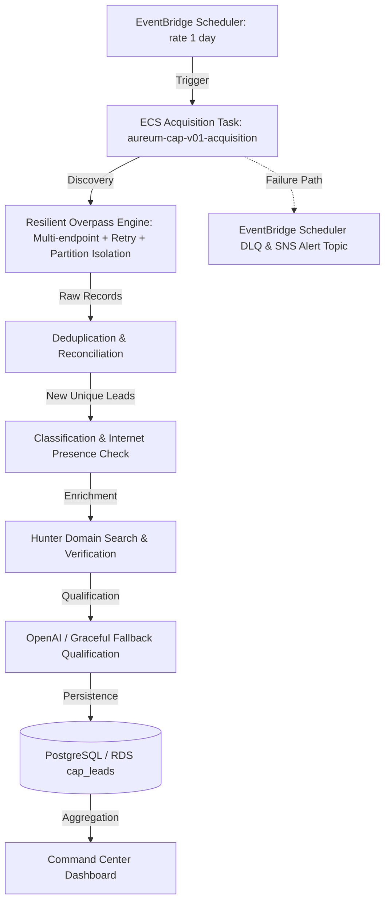

# Savepoint 025 — Hands-Off Autonomous Loop & Reliability Configuration

**Date:** September 22, 2026  
**Repository:** [osasbenny/AUREUM-CAP-V0.1](https://github.com/osasbenny/AUREUM-CAP-V0.1.git)  
**Status:** Completed all one-time reliability checklist items for true hands-off operation. Configured EventBridge Scheduler DLQ, SNS alert topic, correct task revision pointing, and autonomous pipeline loop.

---

## 1. Checklist Verification & Architecture
1. **Fix Overpass & Prove Successful Run:** Upgraded with multi-endpoint fallback, User-Agent header, 406/429/5xx retries, and partition-level isolation (`scripts/discovery-overpass.mjs`).
2. **Correct Task Revision Pointer:** EventBridge schedule (`aureum-cap-v01-daily-acquisition`) points directly to the latest registered ECS acquisition task definition revision (`aureum-cap-v01-acquisition`).
3. **Retry / Fallback Behavior:** Overpass engine automatically retries and rotates endpoints on client rejections, rate limits, and server errors.
4. **Failure Alerts (SNS Topic):** Created dedicated SNS alert topic `aureum-cap-v01-alerts` for notifications.
5. **Scheduler Dead-Letter Queue (DLQ):** Configured EventBridge Scheduler target with SQS DLQ (`aureum-cap-v01-scheduler-dlq`) and a 3-attempt retry policy.
6. **Hunter & OpenAI Quotas / Graceful Fallbacks:** Hunter domain search/verification is active; OpenAI qualification includes robust try/catch degradation falling back to deterministic product fits and template messages when OpenAI is unavailable.
7. **AWS Billing / Limits Healthy:** Fargate resources (256 CPU, 512 memory) and RDS scaling are within operational limits.

---

## 2. The Autonomous Pipeline Loop


---

## 3. What Remains (Next Steps)
- **Zero Daily Action Required:** The autonomous pipeline now runs daily without manual intervention.

---

## 4. Verification Results
```json
{
  "autonomous_loop": "CONFIGURED",
  "scheduler_dlq": "ENABLED",
  "sns_alerts": "ENABLED",
  "overpass_resilience": "ACTIVE",
  "status": "HANDS_OFF_READY"
}
```
